# Luxival Website Structure

This file documents the current website information architecture (IA) and conversion paths.

## 1. Top-Level Structure

- Home: /index.html
- Digital Services: /services.html
- Tourism and Transport: /tourism.html
- Portfolio: /portfolio.html
- QA and Audit: /qa.html, /audit.html
- Booking: /booking.html
- Contact: /contact.html
- About: /about.html
- Blog: /blog/index.html
- Legal: /privacy.html, /terms.html

## 2. Detailed Page Groups

### Core pages
- /index.html
- /services.html
- /tourism.html
- /portfolio.html
- /qa.html
- /booking.html
- /contact.html
- /about.html

### Conversion and utility pages
- /audit.html
- /thank-you-digital.html
- /thank-you-transfer.html
- /hub.html

### Product/showcase pages
- /platform.html
- /esg-compliance-auditor.html
- /esg-live-embed.html
- /pattern.html

### Content pages
- /blog/index.html
- /blog/posts/*

### Service detail pages
- /services/airport-transfer.html
- /services/ai-agents.html
- /services/city-to-city.html
- /services/electrical-design.html
- /services/hotel-sourcing.html
- /services/mechanical-design.html
- /services/private-pickup.html
- /services/private-rides.html
- /services/sewing-pattern.html
- /services/software-testing.html
- /services/tiktok-agency.html
- /services/web-design.html

## 3. Structure Diagram (Mermaid)

```mermaid
flowchart TD
    A[Luxival Website]

    A --> B[Home /index.html]
    A --> C[Digital Services /services.html]
    A --> D[Tourism and Transport /tourism.html]
    A --> E[Portfolio /portfolio.html]
    A --> F[QA and Audit]
    A --> G[Booking /booking.html]
    A --> H[Contact /contact.html]
    A --> I[About /about.html]
    A --> J[Blog /blog/index.html]
    A --> K[Legal]

    F --> F1[QA /qa.html]
    F --> F2[Audit /audit.html]

    K --> K1[Privacy /privacy.html]
    K --> K2[Terms /terms.html]

    C --> C1[Service Detail Pages /services/*]
    D --> D1[Transfers /transfers.html]
    D --> D2[Tourism Planning /tourism-planning.html]

    E --> E1[ESG Showcase /esg-compliance-auditor.html]
    E --> E2[ESG Embed /esg-live-embed.html]
    E --> E3[Platform /platform.html]

    J --> J1[Blog Posts /blog/posts/*]

    G --> T1[Thank You Digital /thank-you-digital.html]
    G --> T2[Thank You Transfer /thank-you-transfer.html]
```

## 4. Main Conversion Paths

- Digital funnel:
  - /index.html -> /services.html -> /portfolio.html -> /contact.html
- Transport funnel:
  - /index.html -> /tourism.html -> /booking.html -> /thank-you-transfer.html
- Audit funnel:
  - /index.html -> /qa.html or /audit.html -> /contact.html or premium audit flow

## 5. Notes

- This structure file should be updated whenever new pages are added or primary navigation changes.
- Keep this as the source-of-truth architecture reference for planning and QA.
